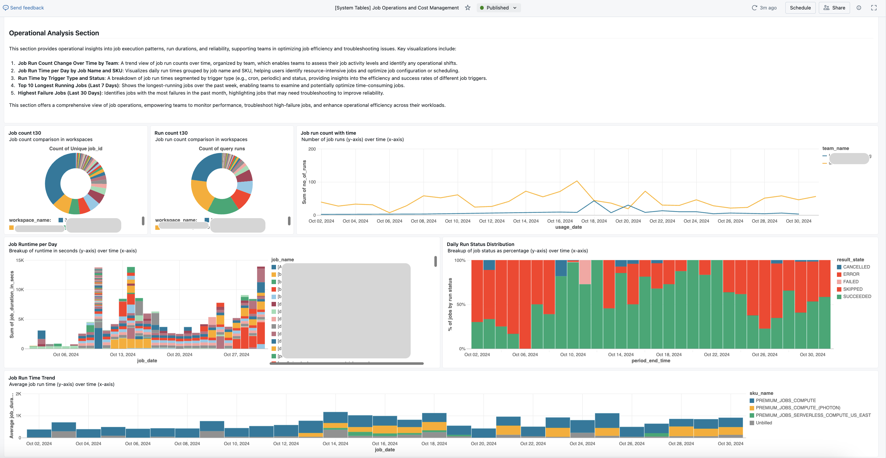

# Databricks Dashboard Suite

<!-- TOC -->
* [Databricks Dashboard Suite](#databricks-dashboard-suite)
  * [Overview](#overview)
  * [Dashboards Included](#dashboards-included)
  * [Repository Structure](#repository-structure)
  * [Setup and Usage](#setup-and-usage)
    * [[Option 1] Using Databricks Git folders (Repos)](#option-1-using-databricks-git-folders-repos)
    * [[Option 2] Manually downloading and importing files into the workspace](#option-2-manually-downloading-and-importing-files-into-the-workspace)
    * [Run the `create_dashboards` Notebook](#run-the-create_dashboards-notebook)
    * [Complete Deployment](#complete-deployment)
  * [Updating Dashboards](#updating-dashboards)
  * [Tables and Functions Created During Deployment](#tables-and-functions-created-during-deployment)
      * [**Tables**](#tables)
      * [**SQL Functions**](#sql-functions)
  * [Conclusion](#conclusion)
    * [Disclaimer](#disclaimer)
<!-- TOC -->

## Overview

This repository contains a suite of analytics dashboards for Databricks environments, designed to provide detailed insights into cost allocation, performance metrics, data lineage, and compute efficiency. These dashboards, built using the [Databricks System Tables](https://docs.databricks.com/en/admin/system-tables/index.html), support efficient management of resources across workspaces, entities, and teams within Databricks, offering both high-level overviews and in-depth analysis tools.


## Dashboards Included

1. **[Databricks Unified Cost Analysis Dashboard](system_table_dashboards/%5BSystem%20Tables%5D%20Databricks%20Unified%20Cost%20Analysis.lvdash.json)**  
   Focuses on overall cost distribution across various compute types, such as all-purpose clusters, Delta Live Tables (DLT), jobs, model inference, and SQL. Ideal for quick cost insights, it includes:  
   * **Daily Spend per Compute Type Over Time** – Visualizes cost trends for each compute type (e.g., SQL, Jobs, DLT, model inference).
   * **Spend Comparison** – Shows spend in the last 30 days vs. the previous 30 days.
   * **Weekly Cost Change Percentage** – Displays week-over-week cost fluctuations.
   * **Daily Spend by Workspace** – Breaks down costs per workspace.
   * **Cost by Compute Type and Workspace** – Analyzes the most recent 30-day spend by each compute type and workspace.  
   For in-depth, segmented analysis, check the specific dashboards below.

2. **[Job Operations and Cost Management Dashboard](system_table_dashboards/%5BSystem%20Tables%5D%20Job%20Operations%20and%20Cost%20Management.lvdash.json)**  
   Analyzes job-related costs, operational efficiency, and cluster resource utilization. This dashboard helps monitor job performance, manage cluster costs, and identify high-cost jobs:
   * **Daily Cost by Workspace and SKU** – Monitors daily job-related costs across workspaces.
   * **Cost by Team and User Allocation** – Allocates costs by team and user.
   * **Job Run Time Analysis** – Tracks job count, run count trends, and run times grouped by job name, SKU, and trigger type.
   * **Most expensive and Failing Jobs** – Identifies expensive, highest-failure, and most retried jobs over time.
   * **Cluster Performance Analysis** – Shows memory and CPU utilization, outdated DBR usage, and job counts with fixed workers or all-purpose compute.

3. **[DBSQL Cost & Query Performance Dashboard](system_table_dashboards/%5BSystem%20Tables%5D%20DBSQL%20Cost%20&%20Query%20Performance.lvdash.json)**  
   Designed for SQL workloads, this dashboard provides in-depth analysis of SQL costs, query performance, and warehouse efficiency. It helps in tracking SQL usage by team and workspace:
   * **Daily Cost by Workspace and SKU** – Tracks daily SQL costs per workspace.
   * **Cost by Team and User Allocation** – Attributes costs by teams and users.
   * **Cost Change Over Time** – Week-over-week change in SQL costs.
   * **Expensive Query Details** – Table listing costly queries for performance improvements.
   * **Query Count and Run Time Analysis** – Analysis of query counts, run times, queue times, and breakdowns by statement type and source app.
   * **Warehouse Utilization** – Insights on warehouse counts, cluster activity times, and query spills.

4. **[Data Lineage and Catalog Utilization Dashboard](system_table_dashboards/%5BSystem%20Tables%5D%20Data%20Lineage%20and%20Catalog%20Utilization.lvdash.json)**
   Provides insights into data lineage, usage patterns, and catalog utilization. It supports data governance efforts by showing entity access, catalog trends, and table-specific access and lineage:
   * **Table vs. Path Access** – Access patterns across various entities.
   * **Active User Distribution** – Pie chart showing active users.
   * **Entity Type Usage Over Time** – Changes in entity usage patterns.
   * **Catalog and Team Usage** – Catalog usage by teams and entity types.
   * **Table Access Details** – Includes access frequency by entity, user-level access, and upstream/downstream table lineage.



## Repository Structure

```plaintext  
├── comprehensive-dashboard-suite
│   ├── README.md                                                               # Project overview and documentation  
│   ├──system_table_dashboards                                                 # Folder containing all dashboards and code  
│   │   ├── [System Tables] Databricks Unified Cost Analysis.lvdash.json        # Code for Databricks Unified Cost Analysis Dashboard  
│   │   ├── [System Tables] Job Operations and Cost Management.lvdash.json      # Code for Job Operations and Cost Management Dashboard  
│   │   ├── [System Tables] DBSQL Cost & Query Performance.lvdash.json          # Code for DBSQL Cost & Query Performance Dashboard  
│   │   ├── [System Tables] Data Lineage and Catalog Utilization.lvdash.json    # Code for Data Lineage and Catalog Utilization Dashboard  
│   │   ├── create_dashboards.ipynb                                             # Python code to deploy the dashboards to your Databricks  
└── └── └── extract_dashboard.ipynb                                           # Python code to extract a specific dashboard
```
## Setup and Usage

The project must be imported to a Databricks workspace by either of these 2 options:
- Using Databricks Git folders (Repos)
- Manually downloading and importing files into the workspace

### [Option 1] Using Databricks Git folders (Repos)
* **Configure Git folders** - Use [Git folders](https://docs.databricks.com/en/repos/repos-setup.html) in Databricks to check out this project and run notebooks. Steps to be done:
  * Open your Databricks workspace.
  * Navigate to **Workspace** in the sidebar, (optional \- select any folder) then click on the **Create** button. 
  * Select **Git folder**.
  * Add this in Git repository URL to clone it into your Databricks environment: https://github.com/databricks-solutions/databricks-blogposts
  * Click on **Create Git folder**.  
    Once cloned, you’ll see all repository files in your Workspace. Click on **comprehensive-dashboard-suite** and then on the **system_table_dashboards** folder.

### [Option 2] Manually downloading and importing files into the workspace

* **Download Required Files** - To get started, download each of the files [located](system_table_dashboards) in the `system_table_dashboards` folder of this repository. These files contain all the necessary resources and dependencies required to enable the dashboards.
* **Import into Databricks Workspace** - After downloading, [import](https://docs.databricks.com/en/notebooks/notebook-export-import.html#import-a-notebook) each of the files into your Databricks workspace to ensure all files become available for immediate use. To do this:

  * Open your Databricks workspace.  
  * Navigate to **Workspace** in the sidebar, (optional \- select any folder) then create a folder named **system_table_dashboards** (or similar).
  * Get inside the folder and click on the kebab menu (three vertical dots) and select the **Import** button.  
  * Choose each of the files you downloaded and upload it to your workspace.

### Run the `create_dashboards` Notebook
In your workspace, open the `create_dashboards` notebook. This notebook is designed to deploy the dashboards and set up required resources. It includes several parameters, starting with **`actions`**:

* **`actions` (Multi-Select Dropdown)**: This parameter allows you to select specific tasks to perform during deployment, with the following options:  
  * **All**: Runs all available actions, suitable for first-time deployment as it initializes all components required for the dashboards.  
  * **Deploy Dashboards**: Deploys only the dashboards without publishing or other setup actions.  
  * **Publish Dashboards**: Publishes the dashboards, making them available for use in the workspace.  
  * **Create Functions**: Sets up custom SQL functions needed within the dashboards.  
  * **Create/Refresh Tables**: Updates or refreshes tables that provide essential data to the dashboards.  
**Note**: For the first deployment, select **All** to ensure all setup steps, including dashboard deployment, function creation, and table refreshes, are completed.  
* **`warehouse` (Dropdown)**:   
  This parameter lists all available SQL warehouses in the workspace. Select one from the dropdown to be used by the dashboards for executing queries and processing data. **Serverless warehouses** are preferred as they offer optimized performance and are denoted by \*\* at the end of their name. Choosing an appropriate warehouse helps ensure efficient data handling across all dashboards.  
* **`catalog` (Text Input)**:  
  Specify a UC catalog where the user has **read and write permissions**. This catalog will house the [tables and functions required](#tables-and-functions-created-during-deployment) by the dashboards. If the specified catalog does not already exist, it will be created automatically during deployment.  
* **`schema` (Text Input)**:  
  Provide the schema name within the selected catalog. This schema will store all necessary tables and functions. Like the catalog, if the schema does not exist, it will be created as part of the setup.  
* **`tags_to_consider_for_team_name` (Comma-Separated Text Input)**:  
  This parameter defines which tag keys should be used to identify teams for charts displaying usage metrics by team. Provide a comma-separated list of tag keys, based on the organization’s tagging convention for clusters, warehouses, jobs, etc.  
  * For example:  
    * If clusters are tagged with `team_name:<name of team>`, enter `team_name`.  
    * If multiple tag keys are used (e.g., `team_name` for some clusters and `group_name` for others), provide both keys, such as `team_name,group_name`. This setup ensures that all relevant teams are accurately captured in the dashboards.

**Account API [Optional] Parameters**  
These parameters are only required if you want **workspace names** (instead of workspace IDs) to display within the dashboards. The dashboards are built using system tables, which currently store only workspace IDs. These parameters allow the dashboards to connect to the account console to retrieve workspace names via the Databricks Account API. Note that account-level access (using M2M OAuth) is required to populate the **workspace\_reference** table with workspace names. [How to get these?](https://docs.databricks.com/en/dev-tools/auth/index.html#how-do-i-use-oauth-to-authenticate-with-databricks)

* **`account_host`**: The URL of the Databricks account host.  
* **`account_id`**: The identifier for the Databricks account.  
* **`client_id`**: The client ID of the Databricks service principal, used for machine-to-machine (M2M) authentication.  
* **`client_secret`**: The client secret for the Databricks service principal, required for M2M authentication.

If these parameters are left blank, the **workspace\_reference** table will be created without workspace names, with workspace IDs populated in the `workspace_name` column instead. For those without account console access, workspace names can be manually added to the `workspace_reference` table later, allowing the dashboards to display workspace names where desired.

### Complete Deployment

Once all parameters are configured, run the `create_dashboards` notebook on a **Unity Catalog (UC) supported cluster** (serverless is recommended). Running the notebook will deploy all dashboards, which will then be available for use under the **Dashboards** section in your workspace. Click on the `[System Tables] Databricks Unified Cost Analysis Dahsboard`. This will contain links to the other dashboards.

## Updating Dashboards

The dashboards can be updated as data or configurations change over time. The `create_dashboards` notebook provides multiple actions that can be used on an ad-hoc basis to refresh or maintain your dashboards:

* **Publish Dashboards**: Re-publishes dashboards to the workspace to ensure any updates made to dashboard definitions are reflected. This can be used if manual changes are made and need to be re-deployed across the environment.

* **Refresh Tables**: Ensures that reference tables, such as workspace_reference and warehouse_reference, are current. Running this action periodically is essential to capture new or updated warehouse names and workspace details for accurate reporting.

In addition to the `create_dashboards` notebook, the `extract_dashboard` notebook is available to capture updates to any dashboards. Since `create_dashboards` deploys dashboards directly from JSON files in the repository, any manual changes made to dashboards in the workspace will be overwritten when `create_dashboards` is re-run.

Use the **`extract_dashboard`** notebook to capture these changes:

* If any manual change is made in any of the dashboards, run the **`extract_dashboard`** notebook selecting that specific dashboard as a parameter.  
* This notebook extracts the latest version of any dashboard in the workspace and saves it back to the corresponding JSON file.  
* Running `extract_dashboard` ensures that future deployments with `create_dashboards` will include all manual modifications, preventing loss of updates. 

These actions provide flexibility to maintain and refresh dashboards efficiently, helping keep visualizations aligned with the latest data and configurations.


## Tables and Functions Created During Deployment

As part of the deployment, several tables and functions are created to support data analysis and visualization within the dashboards. These objects are stored in the specified catalog and schema defined during setup.

#### **Tables**

1. **`workspace_reference`**  
   * **Description**: Stores mappings between `workspace_id` and `workspace_name` to display readable names within the dashboards.  
   * **Usage**: Enables use of workspace names instead of IDs. If account-level access parameters are provided, this table is populated automatically with workspace names. Otherwise, `workspace_id` will be used in place of `workspace_name`, with the option for users to manually update commonly used workspaces.  
2. **`warehouse_reference`**  
   * **Description**: Contains a mapping between `warehouse_id` and `warehouse_name` to make warehouse references more efficient in dashboard queries.  
   * **Usage**: Improves dashboard performance by avoiding frequent joins with `system.access.audit` to retrieve warehouse names. The `audit` tables cover only the last year and track warehouses within the current workspace, potentially missing older warehouse names or those from other workspaces in the account. To keep this table updated with new warehouse names, users should frequently run the **Create/Refresh Tables** action in the `create_dashboards` notebook. Once system tables include warehouse names (future roadmap), this reference table will no longer be necessary.

#### **SQL Functions**

1. **`job_type_from_sku`**  
   * **Description**: Identifies the job type (e.g., classic job, job with Photon, serverless job) from the SKU.  
   * **Usage**: Provides granularity for job cost analysis by job type, helping in comparing performance and cost metrics across different job setups.  
2. **`sql_type_from_sku`**  
   * **Description**: Determines the SQL warehouse type (e.g., Pro, Classic, Serverless) based on SKU.  
   * **Usage**: Supports analysis and cost breakdowns for SQL warehouses, giving insights into cost and usage patterns across warehouse types.  
3. **`team_name_from_tags`**  
   * **Description**: Extracts the team name based on tag keys provided in the `tags_to_consider_for_team_name` parameter.  
   * **Usage**: Allows dashboards to segment costs and usage data by team, even if multiple tag keys (e.g., `team_name`, `group_name`) are used across clusters for team designation.


## Conclusion

Thank you for exploring the **Databricks Dashboard Repository**\! This project aims to enhance your data analysis and visualization capabilities by providing comprehensive dashboards built on key system tables.

We hope you find these dashboards useful for your analytical needs. If you have any questions, suggestions, or need assistance with the setup and usage, please feel free to reach out via the [Issues](https://github.com/mohanab89/databricks-dashboard-suite/issues) page.

Happy analyzing!

### Disclaimer

This project and the accompanying dashboards are not official Databricks products. They are community-built resources provided as-is, with no dedicated ongoing support. Please review and test in your environment, as they are intended for use at your own risk.