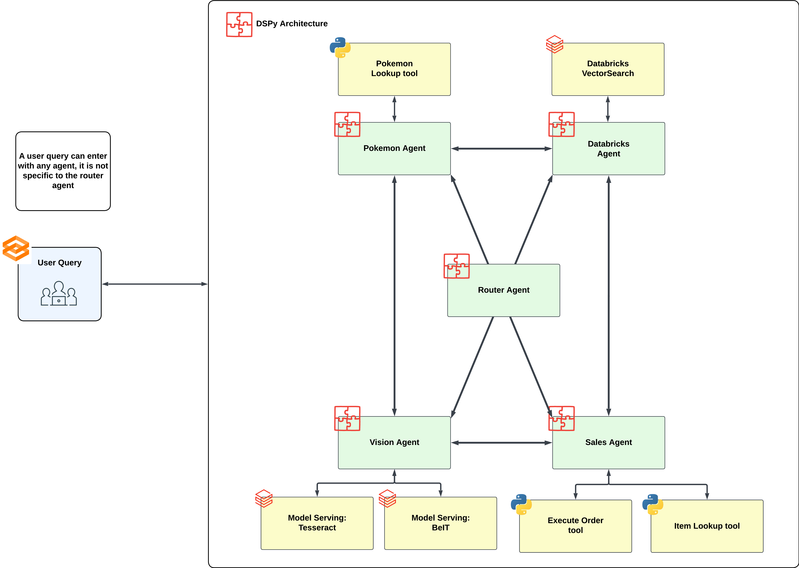

# Enable Multi-Agents + Classic ML using Databricks and DSPy!
This repository contains code accompanying the blog [Enable Multi-Agents + Classic ML using Databricks and DSPy!] https://medium.com/@austinchoi/enable-multi-agents-classic-ml-using-databricks-and-dspy-918f78c16e3a

This is primarily an educational demonstration of how you can design Agents to work together to answer a wide variety of questions or figure out and complete tasks in the face of adversity. 

Through this demo, you should learn the following: 
1. You should be using LLMs + Traditional ML (The Vision Agent will demonstrate this) 
2. Tool calling is almost mandatory to ensure up to date and accurate information (The Pokemon Agent will demonstrate this) 
3. We can make RAG better with Agents (The Databricks Agent will demonstrate)

A chatbot is not the only use case for this code. In fact, it is likely other Use Case like ETL pipelines would benefit more from this solution. However, to demonstrate the interaction between agents, it is show through a Gradio Interface 

Below is a diagram of how the Agents work together to answer a user's question: 

## Code 
[Multi-Agent Recreation](https://github.com/databricks-solutions/databricks-blogposts/blob/main/dspy-multi-agent-with-classic-ML/Multi_Agent_Recreation.py) Much of the set up occurs in the config file to set up your Databricks Environment

[config](https://github.com/databricks-solutions/databricks-blogposts/blob/main/dspy-multi-agent-with-classic-ML/config) This folder contains the notebooks and assets that will help recreate the demo one for one

## License
| Library | License |
|---------|---------|
| dspy     | [MIT](https://github.com/stanfordnlp/dspy/blob/main/LICENSE)     |
| langchain     | [MIT](https://github.com/langchain-ai/langchain/blob/master/LICENSE)     |
| lxml      | [BSD-3](https://pypi.org/project/lxml/)     |
| transformers      | [Apache 2.0](https://github.com/huggingface/transformers/blob/main/LICENSE)     |
| unstructured      | [Apache 2.0](https://github.com/Unstructured-IO/unstructured/blob/main/LICENSE.md)     |
| llama-index      | [MIT](https://github.com/run-llama/llama_index/blob/main/LICENSE)     |
| tesseract      | [Apache 2.0](https://github.com/tesseract-ocr/tesseract/blob/main/LICENSE)     |
| poppler-utils      | [MIT](https://github.com/skmetaly/poppler-utils/blob/master/LICENSE)     |
| textstat      | [MIT](https://pypi.org/project/textstat/)     |
| tiktoken      | [MIT](https://github.com/openai/tiktoken/blob/main/LICENSE)     |
| evaluate      | [Apache 2.0](https://pypi.org/project/evaluate/)     |
| torch      | [BSS-3](https://github.com/intel/torch/blob/master/LICENSE.md)     |
| pytesseract      | [Apache 2.0](https://pypi.org/project/pytesseract/)     |
| pillow      | [MIT-CMU](https://github.com/python-pillow/Pillow?tab=License-1-ov-file#readme)     |
| pypdf      | [BSD-3](https://github.com/py-pdf/pypdf?tab=License-1-ov-file#readme)     |
| llama-index      | [MIT](https://github.com/run-llama/llama_index?tab=MIT-1-ov-file#readme)     |
